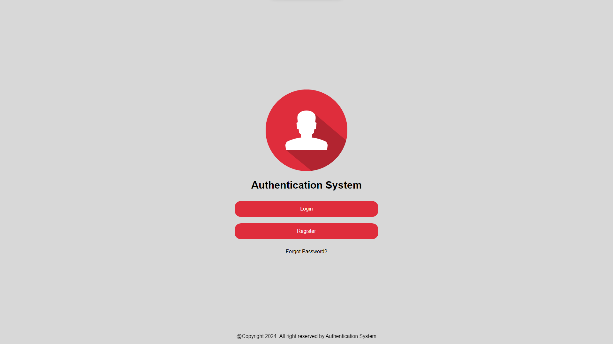
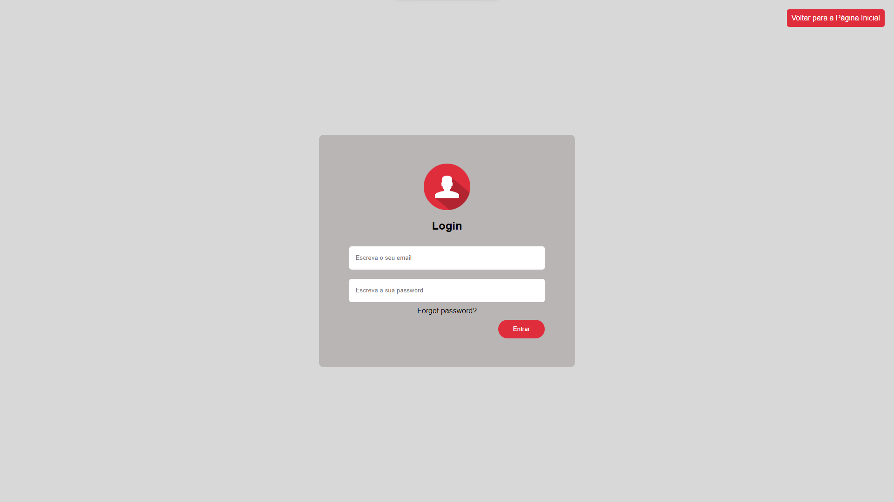
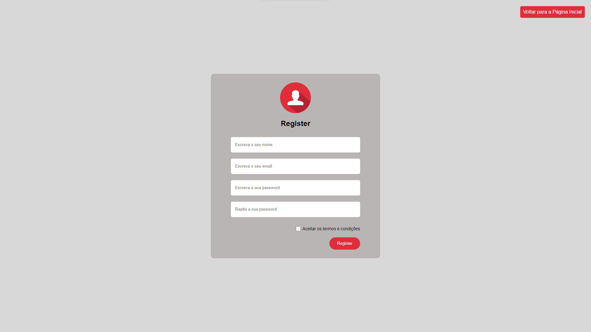
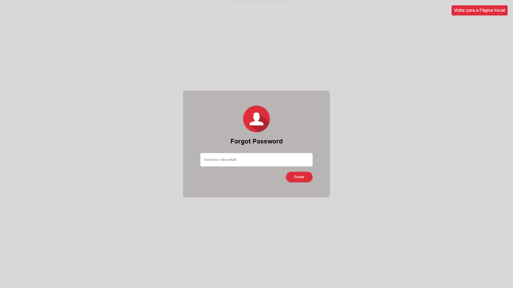

# Authentication System  (FrontEnd)

  

## Descrição

Este projeto é um exemplo básico que opera exclusivamente no frontend. 

**Nota:** Este projeto não lida com lógica de autenticação no backend; é puramente ilustrativo e destinado a fins educacionais para entender o fluxo de registro no frontend.

## Instruções de Instalação

1. Clone o repositório: `git clone https://github.com/cesar-daniel15/pw-labs`
2. Abra o arquivo `index.html` em um navegador web.

## Capturas de Ecra

